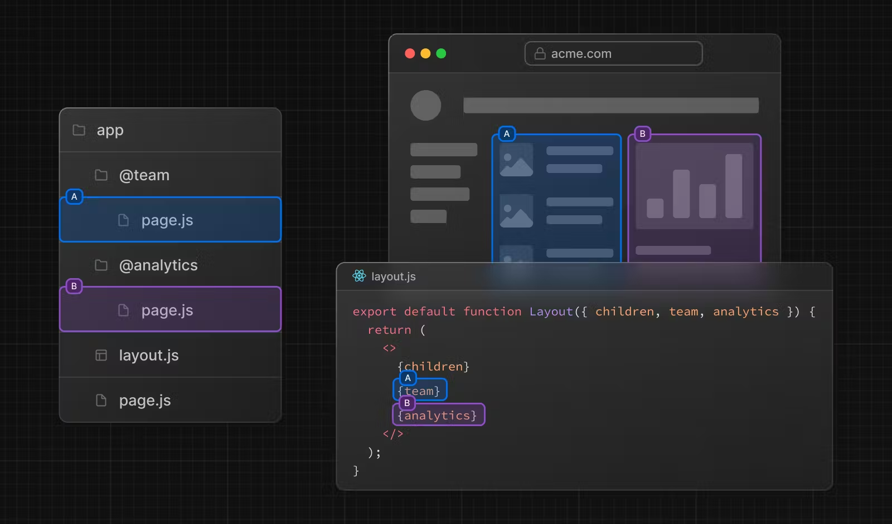
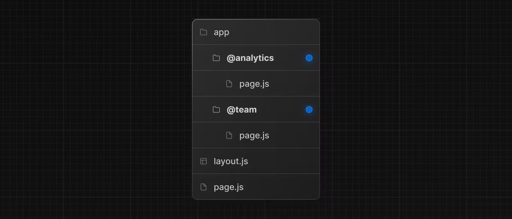
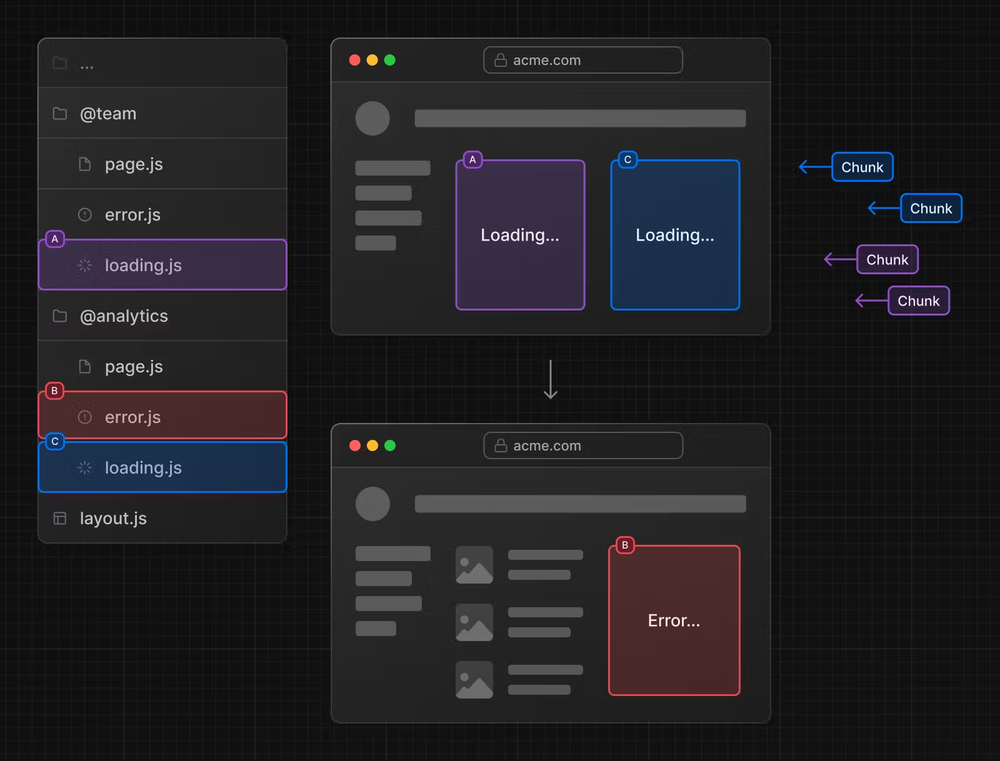

# Parallel Routes

병렬 경로(Parallel Routes)를 사용하면 동시에 또는 조건부로 동일한 레이아웃 내에서 하나 이상의 페이지를 렌더링할 수 있다.

대시보드나 소셜 사이트의 피드와 같이 앱의 매우 동적인 섹션에 유용하다.



## Slots

Parallel Routes는 slots로 생성된다. Slots는 `@folder` 와 같은 파일 컨벤션을 사용한다.



슬롯은 공유된 부모 레이아웃(layout)에 속성(props)으로 전달된다. 위의 예에서는 app/layout.js의 컴포넌트가 이제 `@analytics` 및 `@team` 슬롯을 속성(props)으로 받을 수 있으며, 이를 children 속성(props)과 함께 병렬로 렌더링할 수 있다.

```js
export default function Layout({
  children,
  team,
  analytics,
}: {
  children: React.ReactNode
  analytics: React.ReactNode
  team: React.ReactNode
}) {
  return (
    <>
      {children}
      {team}
      {analytics}
    </>
  )
}
```

참고로, slots는 라우트 세그먼트가 아니기 때문에 url 구조에 영향을 주지 않는다.
예를들어, `/dashboard/@analytics/views` 로 정의된 경우, url은 `/dashboard/views`가 될 것이다.

## Loading and Error UI



병렬 경로는 독립적으로 스트리밍될 수 있어, 각 경로에 대해 독립적인 오류 및 로딩 상태를 정의할 수 있게 해줍니다:

### 참고

[Parallel Routes](https://nextjs.org/docs/app/building-your-application/routing/parallel-routes)
