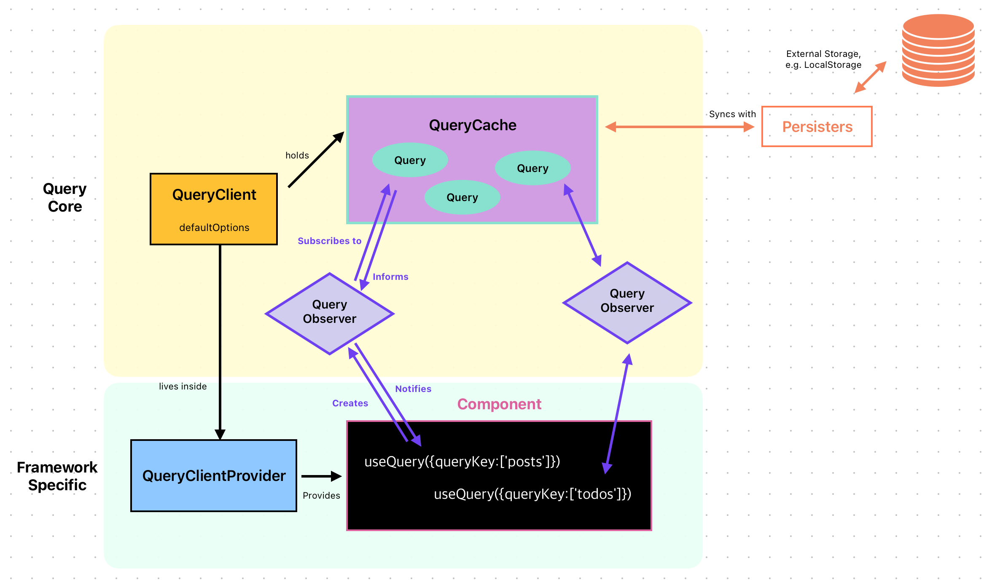

# Inside React Query

참고 링크 본문 내용 번역하며 이해하기

## The QueryClient

앱의 최 상단에서 인스턴스를 생성하고 `QueryClientProvider`의 인자로 넘겨줌으로써 어디서든 사용할 수 있다.

`QueryClientProvider`는 React Context를 사용해서 `QueryClient`를 앺의 어디서든 사용할 수 있게 한다.

어디서든 `useQueryClient`를 사용해서 queryClient에 접근할 수 있다.

```js
const queryClient = new QueryClient();

function App() {
  return (
    <QueryClientProvider client={queryClient}>
      <div></div>
    </QueryClientProvider>
  );
}
```

### A vessel that holds the cache

> 캐시를 보관하는 저장소(?)

`QueryClient` 자체는 그다지 큰 역할을 하지 않는다. `new QueryClient`를 생성할 때 자동으로 생성되는 `QueryCache`와 `MutationCache`를 담고있는 컨테이너의 역할을 한다.

또한 모든 쿼리 및 변경사항에 대해 설정할 수 있는 기본값을 가지고 있으며, cache를 사용하는 편리한 메서드들을 제공해준다. 보통 cache에 직접적으로 접근하지 않고 `QueryClient`를 통해서 접근한다.

## QueryCache

client가 캐시를 사용할 수 있게 해준다는 것을 알았다. 그렇다면 캐시는 무엇인가?

간단히 말해서, `QueryCache`는 키(key)들은 queryKey들이 안정적으로 직렬화된 버전인 queryKeyHash이고 값(value)들은 `Query` 클래스의 인스턴스인 in-memory 객체이다.

리액트 쿼리는 기본적으로 메모리에 데이터만 저장하고 다른 곳에 저장하지 않는 다는 점을 이해하는 것이 중요하다. 브라우저의 페이지를 다시 로드(reload)하면 cache는 사라진다.localStorage와 같은 외부 스토리지에 캐시를 기록하고 싶다면 [persisters](https://tanstack.com/query/v4/docs/framework/react/overview)를 살펴봐라.

## Query

캐시에는 query들이 저장되어져 있고, 이 `Query`에서 대부분의 로직이 발생한다. 쿼리에 대한 모든 정보들 (data, status, 언제 마지막 패치가 일어났는지와 같은 meta information) 을 담고있을 뿐만 아니라, query function,재시도,취소 및 중복제거 로직을 수행하기도 한다.

내부에 `state machine`을 갖고있어서 불가능한 상태로 빠지지 않도록 해준다. 예를들어, fetch하는 동안 query function이 트리거된다면, 그 fetch는 중복제거될 수 있다. 쿼리가 취소된다면, 이전 상태로 돌아간다.

가장 중요한 것은, query는 query data에 누가 관심을 갖고 있는지 **알고있으며**, 모든 변경 사항을 `Observers`에게 알릴 수 있다는 점이다.

## QueryObserver

`Observer`는 `Query` 와 우리가 사용하고자하는 컴포넌트 간의 연결고리이다.
`Observer`는 `useQuery`를 사용할 때 생성되고, 항상 정확히 하나의 쿼리에 연결된다. 이것이 `useQuery`에 `queryKey`를 전달해야하는 이유이다.

`Observer`는 좀 더 많은 일을 한다. 여기서 대부분의 최적화가 발생한다. `Observer`는 컴포넌트가 `Query`의 어떤 속성들을 사용하는지 알고있어서 관련없는 변경사항에 대해 알릴 필요가 없다. 예를들어, data 필드만 사용하는 경우, 컴포넌트는 `isFetching` 속성이 백그라운드 리패치 시 변경되더라도 컴포넌트를 리렌더링할 필요가 없다.

더 나아가, 각 `Observer`는 `select` 옵션을 가질 수 있어서, data 필드의 어떤 부분에 관심있는지를 결정할 수 있다. 이 최적화에 관한 더 자세한 설명은 👉 [ #2: React Query Data Transformations](https://tkdodo.eu/blog/react-query-data-transformations#3-using-the-select-option) 에서 볼 수 있다. 대부분의 타이머, `staleTime`이나 interval fetching도 observer단계에서 발생한다.

### Active and inactive Queries

`Observer`가 없는 쿼리는 '비활성'쿼리라고 한다. 이 쿼리는 여전히 캐시에 남아있지만 어떤 컴포넌트에서도 사용되지 않고 있는 것이다. React Query Devtools에서 확인해보면, '비활성'쿼리는 회색으로 나타나는 것을 볼 수 있다.



종합적으로 봤을때, 대부분의 로직이 프레임워크에 독립적인 Query Core에 존재하는 것을 볼 수 있다.
(`QueryClient`,`QueryCache`,`Query`그리고 `QueryObserver`가 모두 여기 존재하는 것을 볼 수 있다.)

이것이 새로운 프레임워크에 대한 어댑터를 만들기가 상당히 간단한 이유이다. 기본적으로 옵서버를 생성하고 해당 옵서버에 구독하며, 옵서버가 notify되면 컴포넌트를 다시 렌더링하는 방법이 필요하다. React 및 Solid용 useQuery 어댑터는 각각 코드가 100줄 정도밖에 되지 않는다.

### From a component perspective

> 컴포넌트 관점에서

- 컴포넌트가 마운트되면 `useQuery`를 호출하고 `Observer`가 생성된다.
- `Observer`는 `QueryCache`에 있는 `Query`를 구독한다.
- 이 구독은 쿼리가 아직 생성되지 않은 경우 쿼리의 생성ㄹ 트리거할 수 있으며, 데이터가 유효하지 않으면 백그라운드 리패치(refetch)를 트리거할 수 있다.
- 패치를 시작하면 `Query`의 상태가 변경되므로 `Observer`는 이를 알 수 있다.
- `Observer`는 최적화를 수행하고 가능하면 컴포넌트에게 새로운 상태가 렌더될 수 있는 업데이트에 대해 알릴 수 있다.
- `Query`가 실행을 완료하면 `Observer`에게 그 정보를 알린다.

## 참고

[Inside React Query
](https://tkdodo.eu/blog/inside-react-query)
